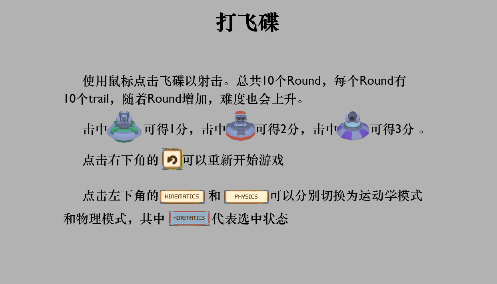
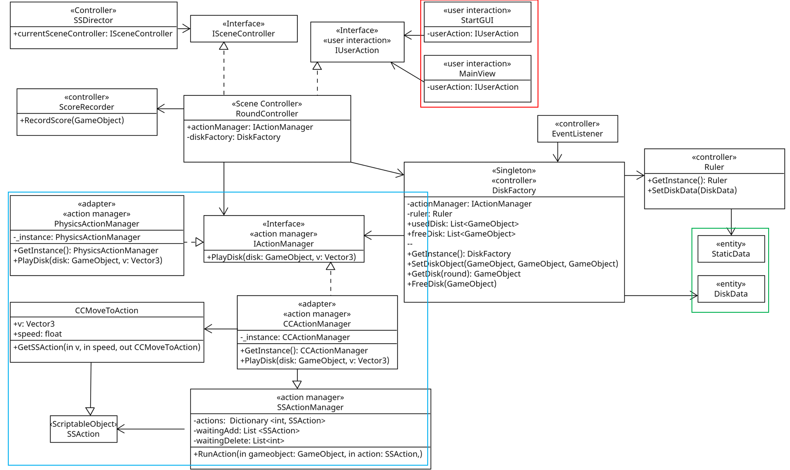
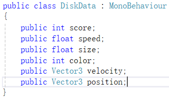
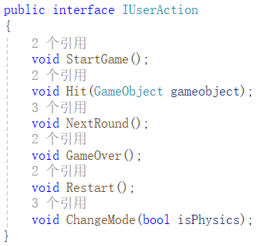

# 打飞碟
- [打飞碟](#打飞碟)
  - [一、前言](#一前言)
  - [二、UML与游戏整体框架](#二uml与游戏整体框架)
  - [三、需求分析与游戏整体设计](#三需求分析与游戏整体设计)
  - [五、模型](#五模型)
  - [四、控制器](#四控制器)
    - [1. 整体设计](#1-整体设计)
    - [2. 具体设计](#2-具体设计)
      - [飞碟的生成与缓存池技术](#飞碟的生成与缓存池技术)
      - [飞碟的运动控制与弧线运动](#飞碟的运动控制与弧线运动)
      - [计分员](#计分员)
  - [五、视图与地形](#五视图与地形)

## 一、前言
打飞碟是一款经典的射击游戏，本游戏实况已放至Bilibili:[https://www.bilibili.com/video/BV14gUzYJENB](https://www.bilibili.com/video/BV14gUzYJENB)

游戏源码已放至Github:[https://github.com/AnliClark/3D-game-learning/tree/main/%E6%89%93%E9%A3%9E%E7%A2%9F/sourceCode/Assets](https://github.com/AnliClark/3D-game-learning/tree/main/%E6%89%93%E9%A3%9E%E7%A2%9F/sourceCode/Assets)

游戏规则如下：
<p align = "center">

</p>

## 二、UML与游戏整体框架
本游戏使用面向对象的设计方式、门面模式、与MVC。

其本主体框架的类图如下所示：
<p align = "center">

</p>

本游戏承接了上次制作魔鬼与牧师时的框架，在其基础上进行了更改。如图红框所示为用户界面部分，它通过使用*IUserAction*接口来与控制器交互，实现了门面模式,便于界面与控制的分离。绿框所示为模型部分，封装了一些飞碟数据。红框与绿框之外即为控制器部分，其中蓝框部分为动作控制部分。

凭借着上次制作牧师与魔鬼打下的基础，我们可以快速构建起项目的框架

## 三、需求分析与游戏整体设计
想要设计好游戏，首先要明确需求。本游戏的简要需求如下：
1. 游戏开始前，先介绍游戏规则
2. 玩家点击开始，进入正式游戏
3. 游戏有10个Round
4. 随Round增加，难度上升
5. 每个Round有10个trail
6. 每trail会出现随机的三种飞碟
7. 玩家用鼠标射击飞碟
8. 玩家可以切换物理模式与运动学模式
9. 玩家可以重来游戏

由上，我们可知，本次游戏的游戏对象只有飞碟，但是飞碟的数据不同，而要存储的模型数据也很简单，基本只有飞碟的数据与一些静态参数。

在动作控制上，我们需要控制飞碟在屏幕一侧飞往另一侧。

在用户交互上，用户可以开始游戏、重来游戏、切换模式、点击飞碟

## 五、模型
本次游戏只有游戏对象飞碟。为了增添游戏的趣味，飞碟的产生是随机的，且随着Round的增加，难度会上升，为了更好的配置飞碟数据，我设计了*DiskData*类来配置飞碟的相关数据。根据需求分析，我们需要配置的数据如下：
<p align = "center">

</p>

## 四、控制器
### 1. 整体设计
控制器控制着视图的显示与模型的数据，控制着整个游戏。为了设计好控制器，我们需要先明确用户需求与用户交互。

根据第三部分，我们可以整理出用户交互表如下：
|动作|结果|备注|
|----|----|----|
|点击开始按钮|游戏开始||
|点击重启按钮|游戏重启||
|点击物理模式或运动学模式|切换模式||
|点击飞碟|飞碟被射击|得到分数|

可以看到总体的用户交互非常简单，主要的难点在于运动的控制。此外，为了更好的节省资源，本次还引入了缓存池技术，通过*DiskFactory*来控制。

### 2. 具体设计
通过以上分析，设计出的用户交互如下：
<p align = "center">

</p>

而在本次难点的飞碟的生成与控制上，我使用*DiskFactory*类来管理飞碟的生成，使用*IActionManger*接口来管理运动。
#### 飞碟的生成与缓存池技术
*DiskFactory*类使用了缓存池技术，它拥有两个列表：usedDisk与freeDisk，且为单实例的类。

当控制器需要生成飞碟时，*DiskFactory*首先查找freeDisk，看是否有符合条件的游戏对象，如果有，则调整参数后返回，如果没有，则重新生成一个游戏对象并把调整参数。之后，将该游戏对象添加到usedDisk中。

当控制器需要释放飞碟时，*DiskFactory*查找usedDisk，将disk移出列表并将其添加到freeDisk中。

其伪代码如下：

```
GetInstance():
BEGIN
    if(_instance is NULL) then
        _instance <- new DiskFactory()
    return _instance
END
GetDisk():
BEGIN:
    if (freeDisk has disk) THEN
	    tmpDisk <- disk
        remove disk from freeDisk
	else
	    tmpDisk <- clone from Prefabs
	Set DiskData of tmpDisk with  ruler
	Add tmpDisk to usedDisk
	return tmpDisk
END
FreeDisk(disk)
BEGIN
	Find disk in usedDisk
	remove disk from freeDisk
END
```

通过以上设计，我们可以减少创建游戏对象的资源消耗。

而对于飞碟的具体数据的配置，我通过专门的*Ruler*类来控制。*Ruler*会随机生成指定范围的数据，并根据Round的不同来总体上调难度。

#### 飞碟的运动控制与弧线运动
本次游戏有两种运动模式：物理模式与运动学模式。他们分别对应了两种运动管理器。为了可以在他们之间自由的切换，我设计了*IActionManager*接口来作为*adapter*，以此使得控制器可以自如的调用两种运动管理器。

由于飞碟要做弧线运动，在物理模式上，飞碟使用了刚体组件。只要配置好射出的方向与位置，物理模式下，运动控制器就不需要再做什么了。由于刚体携带有重力，在有水平初速度的前提下，飞碟会自然的做弧线运动

而对于运动学模式，我使用的运动管理器是上次的*CCActionManager*，它通过每帧更新游戏对象的位置来实现移动。

#### 计分员
为了更好的管控分数以及给用户更好的正向反馈，我专门设计了*ScoreRecorder*类来记录分数，并且实现分数记录的解耦合，与*Ruler*类一起，可以更好的实现游戏具体规则的代码与游戏主体的分离，可以方便的更改规则，适配不同的游戏。

## 五、视图与地形
视图直接与用户交互。通过第三部分的分析，我们可以知道本游戏的用户交互很简单。除了几个按钮外，就只有点击飞碟。只需要在点击按钮与游戏对象时调用*IUserAction*的函数即可。

在判断用户是否点击到游戏对象的方法上，本次游戏使用的是摄像头射线检测。

而由于本次游戏还设置了地形(Terrain)，为了防止用户点击到地形并触发函数，我们可以为地形添加"*Finish*" Tag，并在判断射线是否击中物体前，首先判断Tag，这样就可以防止错误的点击到地形了。