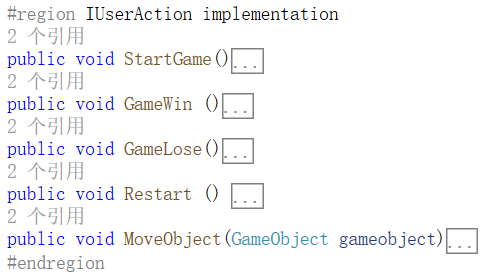

# 【unity】牧师与魔鬼
## 一、前言
牧师与魔鬼是一款经典的益智类小游戏，本游戏的实况已放至Bilibili:[https://www.bilibili.com/video/BV1gVSbYhEb7](https://www.bilibili.com/video/BV1gVSbYhEb7)

游戏源码已放至Github:[https://github.com/AnliClark/3D-game-learning/tree/main/%E9%AD%94%E9%AC%BC%E4%B8%8E%E7%89%A7%E5%B8%88/sourceCode/Assets](https://github.com/AnliClark/3D-game-learning/tree/main/%E9%AD%94%E9%AC%BC%E4%B8%8E%E7%89%A7%E5%B8%88/sourceCode/Assets)   

该游戏的规则如下：
<blockquote>

Priests and Devils

Priests and Devils is a puzzle game in which you will help the Priests and Devils to cross the river within the time limit. There 
are 3 priests and 3 devils at one side of the river. They all want to get to the other side of this river, but there is only one 
boat and this boat can only carry two persons each time. And there must be one person steering the boat from one side to the other 
side. In the flash game, you can click on them to move them and click the go button to move the boat to the other direction. If the 
priests are out numbered by the devils on either side of the river, they get killed and the game is over. You can try it in many 
ways. Keep all priests alive! Good luck!

</blockquote>

## 二、UML与游戏整体骨架
本游戏使用面向对象的设计方式、门面模式、与MVC。

其本主体框架的类属性图与关联图如下所示：

蓝框所示为主管理器。游戏有一个总管理器*SSDirector*，它管理着场景的切换，而具体的场景则由继承了*ISceneController*的场景管理器管理。

为了便于管理动作，又新增了动作管理器，以实现动作管理与场景管理解耦。如橙框所示，动作管理与场景管理之间通过*FirstSceneController*对*CCActionManager*的调用来联系，有效实现了解耦。

用户交互如绿框所示，整合了玩家交互的相关逻辑，便于界面与控制的分离。

以上为初略的游戏整体骨架，它是一个基石，可以被应用到任意游戏中。在制作小游戏时只需要结合具体需求，丰富业务逻辑细节即可。

## 三、规则分析与游戏整体设计
一个游戏必然由其运行规则组成，明确了规则，我们才能更好的明确需求与设计对象。本游戏的规则如下：

1. 在游戏开始前，有新手引导界面
2. 从新手引导界面到游戏正式开始
3. 游戏开始时，左岸有3个魔鬼，3个牧师
4. 船上最多只能载两人
5. 船上至少有一人时，船才能开动
6. 点击船可在左岸与右岸之间移动，且其上的人也应一起移动
7. 当船与人在同一岸时，点击人，可以让人在船与岸上间来回移动
8. 当任意一岸上，牧师数量小于魔鬼，游戏失败
9. 当右岸的人数为6人时，游戏胜利
10. 应有重来的按钮，可以重启整个游戏

由上，我们可以知道，我们需要的模型数据主要是船、牧师与魔鬼。

在动作控制上，我们需要控制人在船上与岸上间来回移动，控制船与人在两岸间移动。

在用户交互上，用户可以点击人和船，在开始的新手引导界面，应有开始的按钮，在开始游戏后，应有重来的按钮。
## 四、模型
### 1. 各个类的设计与模型的架构
模型在MVC模式中是用于存储数据与业务逻辑。根据第三部分，我们可以知道，主要要存储的数据有三类，船、牧师与魔鬼。

牧师与魔鬼的行动相似，可以合并为*Character*类，只在其中添加`bool isPriest`来区分这两个身份。

为了方便的管理所有的角色数据，又增加了*Characters*类，在其中存储所有角色列表、左岸角色列表与右岸角色列表。并且把输与赢的判断逻辑、人物移动时模型的数据修改逻辑放入该类中。

为了方便控制器传参，以及更好的总体管理各游戏对象，我又将*Character*类与*Boat*类抽象，用*AllObject*类作为他们的父类。

此外，为了方便的管理游戏对象的行为，我设置了实体类*Position*类，其中存放有地图各点位的坐标。这样可以在代码编写时不必考虑具体的坐标，实现模块化。

最终，模型侧的具体架构如下图的绿框所示：

在游戏运行过程中，模型并不需要担心人物在画面上是如何移动的，它只需要在控制器调用时，更改模型内的坐标数据，并返回更新后的坐标即可，从Uml图中也可看出，模型只需与场景控制器联系即可。

### 2. 具体设计
在模型的具体设计上，最重要的一点是在用户触发移动游戏对象后的模型更新与输赢判断，这也是模型与其他对象的主要交互。*AllObeject*类应该提供*Move()*方法，以供控制器调用。

对于*Character*，需要通过*Characters*类来处理数据，这是为了确定当前的空余的点位，以及输赢的判断。*Characters*类会维护左右两岸的牧师与魔鬼的数量，位置的坐标以及位置上是否有人。当角色离开岸上时，*Characters*需将对于位置标记为空；当角色上岸时*Characters*需返回可以上岸的位置（即为空的位置）。除此之外，*Characters*有*IsLose()*与*IsWin()*方法供控制器调用，根据两岸的牧师与魔鬼的数量可以判断输赢。

对于*Boat*，它需要维护船上的*Character*是谁以便判断有无空位可以上船，以及在船移动时确定有什么游戏对象要跟着移动，故而，*Boat*需要提供*loadPerson()*与*OutPerson*供*Characters*调用，还要提供*Move()*方法供控制器调用。

## 五、控制器
### 1. 总体设计
控制器联通视图与模型，将用户的交互转化为数据流进行处理，通知模型更新数据，并让视图显示更新后的结果。

控制器是用户交互与内里数据的门面，要设计好控制器，需要先厘清用户有哪些交互。

根据第三部分，我们可以整理出用户交互表如下：

|动作|结果|备注|
|----|----|----|
|点击开始按钮|游戏开始||
|点击重启按钮|游戏重启||
|点击人物|人物在船上与岸上间移动|可能会导致游戏结局|
|点击船|船与船上的人在两岸间移动|船上需有人才能移动|

由此，在场景控制器中，我们需要实现开始、重启、移动游戏对象以及游戏结局。其中，游戏对象的运动事实上介于控制器与视图之间，我们在专门的动作管理器中处理，场景管理器中只需要写一个交互函数，并在其中调用动作管理器的接口即可。

### 2. 具体设计
根据上述分析，我们知道场景控制器需要实现以下的用户交互接口：

*GameWin()*与*GameLose()*都交由专门的裁判类*Referee*来处理。Referee类使用IEndListener接口，并把继承了*IEndListener*的FirstSceneController赋值给该接口。Referee在*Check()*时，会提供调用模型的接口来检查游戏是否结束。当游戏结束时，调用*IEndListener*的*OnEnd()*并把游戏结果作为参数传递给它。FirstSceneController已实现了*OnEnd()*方法，在接收到参数时选择性的调用*GameWin()*或*GameLose()*。

而*MoveObject()*则提供调用动作管理器的接口来实现。场景管理器会给动作管理器传递游戏对象类型的参数，以让动作管理器知道需要移动什么对象。

需要移动的对象由两类：船和人物。动作管理器通过他们的抽象类*AllObject*提供的*Move()*方法来获取参数。*Move()*在人物上会返回人物的目标位置，动作管理器通过该参数来控制游戏对象移动。而船的*Move*方法还需要返回船上的游戏对象及其目标位置：

此外，动作管理器还需要添加*IsActionActive*参数，当动作执行时设置该参数为*false*，防止在人物移动时用户重复点击，导致不可知的移动轨迹。

## 六、视图
视图直接负责着与用户的交互，从第三部分的规则分析以及第五部分的用户交互表，我们可以看出本游戏的用户行为是很简单的，开始按钮与重启按钮可以通过GUI来绘制。

除此之外还需要响应用户的点击游戏对象的事件。这可以通过给游戏对象加载行为脚本*MouseClick*来实现，*MouseClick*会在识别到用户点击时，自动调用SceneController的用户交互的接口。

