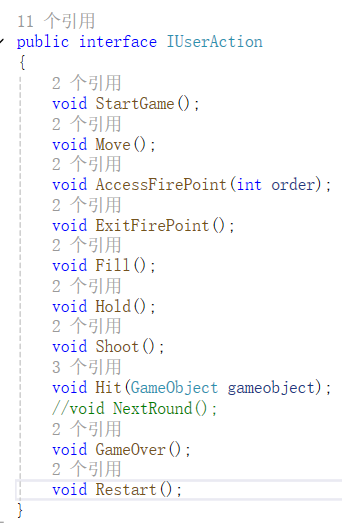
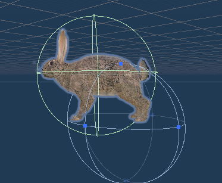
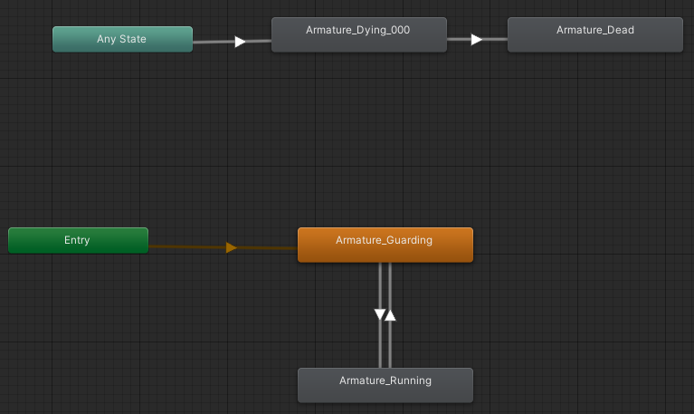
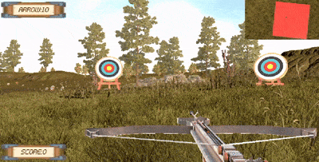
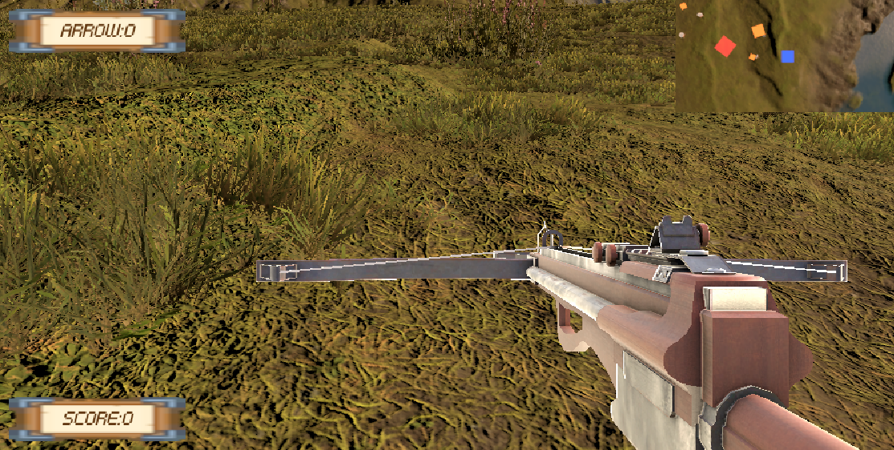

# 【Unity】第一人称射击游戏

## 一、前言
本游戏为一款射击小游戏，玩家可以在草地上使用十字弩射击靶子与小动物。

本游戏实况已放至Bilibili:

游戏源码已放至：[https://github.com/AnliClark/3D-game-learning/tree/main/%E7%AC%AC%E4%B8%80%E4%BA%BA%E7%A7%B0%E5%B0%84%E5%87%BB%E6%B8%B8%E6%88%8F/SourceCode/Assets](https://github.com/AnliClark/3D-game-learning/tree/main/%E7%AC%AC%E4%B8%80%E4%BA%BA%E7%A7%B0%E5%B0%84%E5%87%BB%E6%B8%B8%E6%88%8F/SourceCode/Assets)

## 二、需求分析与游戏整体设计
无论做什么游戏，都需要先明确好需求，并确定玩家可能的交互。

简要的需求分析如下：

   1. 玩家首先阅读新手教程
   2. 玩家正式开始游戏
   3. 玩家可以通过键盘和鼠标自由移动
   4. 玩家只能在射击区域射击
   5. 玩家按住右键蓄力，松开蓄力完成
   6. 玩家按下左键发射
   7. 玩家射中猎物即可得分
   8. 总共3个射击区域，每个区域可以发射10次箭，发射完毕后结束游戏
   9. 玩家可以重启游戏
   10. 右上角有个小地图，按下m键可以调整小地图的视野
   
用户的交互表如下：
|动作|结果|备注|
|----|----|----|
|点击开始按钮|游戏开始||
|移动鼠标|摄像机旋转||
|按下awsd|人物移动||
|按下空格|人物跳跃||
|按住右键|拉弓蓄力||
|按下左键|射击|需要先按下右键|
|按下m键|调整小地图的视野||
|按下r键|游戏重启||
|按下Esc|显示键位图||
|射中猎物|得分|||
|玩家进入射击区域|允许射击||
|玩家离开射击区域|禁止射击||
|玩家射完所有箭|游戏结束||

从以上的简要分析，可以看出，与我往期做的小游戏不同，本游戏的玩家拥有更多的交互行为，所以需要更多的把重心放在玩家交互上。

## 三、MVC与门面模式

本次依然采用MVC与门面模式。但是从第二部分，可以看出，本游戏需要的视图与模型的部分并不多。

视图主要为交互数据与ui按钮的显示，而模型部分主要为猎物的数据。

控制器方面，本次游戏所需操作的对象有很多：需要控制玩家的移动，猎物的随机移动，箭的生成与射出等等。

控制器的需求与用户交互息息相关，我们采用门面模式来实现用户交互与控制核心的分离。

*FirstSceneController*实现了*IUSerAction*接口，而负责用户交互的*UserInteraction*与*FirstPersonContorller*则在用户有交互时调用相应的接口函数，以此实现解耦合。

根据第二部分，写出*IUserAction*的代码如下：

## 四、物品控制
### 1.人物控制
人物的控制直接采用了Unity官方资源包的第一人称控制器。
### 2.猎物控制
由于需要有运动靶，我们还需要控制猎物的运动。我使用的猎物素材为兔子，兔子需要贴着地面行走，而我使用的地形是凹凸不平的。故而，为了保证兔子能够始终贴着地面行走，我为兔子加上了刚体组件，并另其使用重力，之后再给兔子一个向前的力，即可令兔子贴地行走（其中，向前的方向使用`transform.forwards`获取）。

在这个过程中，我遇到了一些困难：兔子在行走时虽然贴地，但是却会摔倒，并且还可能会发生旋转。在解决问题的过程中，我先把兔子的碰撞器从*box*更改为了*capsule*，之后又在刚体的的旋转约束中，限制了x、y和z轴的旋转，终于使得兔子可以正常移动。

而当运动靶（兔子）被击中时，会触发动画*Die*，这只需要设置好动画状态机，再在代码里调用*SetTrigger*即可。

### 3.十字弩与箭的控制
十字弩的*Empty*动画中，十字弩中的箭会停留在射出去一段距离的状态，此时需要把十字弩中的箭设置为失活。

在射箭的*Shoot*动画中，播放结束的那一帧为箭射出一段距离的状态，此时需要在相应位置放至空对象，作为箭生成的点，当*Shoot*动画播放完毕后，就在该点生成新的箭并释放。

由于需要实现半拉弓状态，所以需要使用动画层级以实现半拉弓。通过控制动画层级的权重来控制弦的状态。实现的效果如图：

## 五、摄像机渲染
成功的游戏离不开好的画面。

为了更好的进行渲染，我使用了*cinemachine*。这也会更加方便我控制摄像头。

之后，为了增强玩家的体验，我打算使用双摄像机同时渲染。第二个摄像机将会原来渲染鸟瞰图，所以我在玩家预制中放置了两个*camera*和两个*cinemachineVirtualCamera*。并且在第二个*camera*的设置中，调整了*Viewport Rect*，使其第二个*camera*的渲染画面显示在右上角。

但是，这带来了一个问题，*camera*的*cinemachineBrain*会自动管理*cinemachineVirtualCamera*，这意味着它会自动选择使用哪一个*cinemachineVirtualCamera*。在默认情况下，我的两个*camera*都会自动绑定同一个*cinemachineVirtualCamera*，并且无法修改，使得两个摄像机渲染了同一个画面。解决方法是：把第二个*camera*和*cinemachineVirtualCamera*的层级选择为另一个层级，这样第二个*camera*的*cinemachineBrain*就会自动绑定第二个*cinemachineVirtualCamera*。

为了防止玩家迷路，也为了玩家能够更好的看见特殊点（射箭区域、玩家自己与猎物），我在特殊点的上方增加了有颜色材质的平面，并为他们设置了单独的层级，并且在主摄像机的*culling mask*中取消渲染这个层级，这样，特殊点上方的平面只会在小地图显示，方便玩家确认位置。又由于地图太大，我还添加了m键交互，玩家按下m键，可以缩放右上角的小地图。

实现的效果如图：

