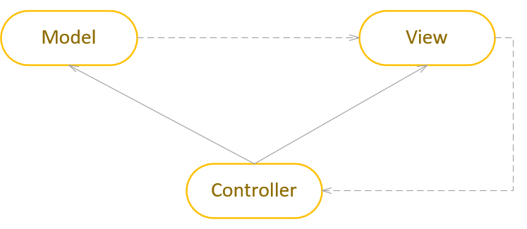
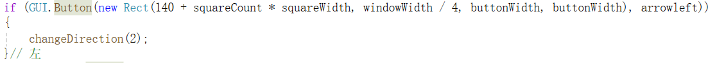

# 初探unity--贪吃蛇游戏与MVC模式
## 一、前言
本游戏为初学unity的练习之作，结合了MVC模式，以实现更好的游戏设计。

本游戏的演示视频已放至[https://www.bilibili.com/video/BV1VqmgYLEzg](https://www.bilibili.com/video/BV1VqmgYLEzg)：

游戏的Assets文件夹已上传至github：https://github.com/AnliClark/3D-game-learning/tree/main/%E8%B4%AA%E5%90%83%E8%9B%87/sourceCode/Assets

## 二、MVC模式
在游戏的开发中，结合MVC（Model-View-Controller）模式能有效地实现数据与游戏逻辑的分离，并为游戏开发带来显著的价值。

### MVC模式概览

MVC模式指的是Model、View与Controller。

Model（模型）：负责处理与游戏相关的数据。它独立于用户界面，不关心如何展示数据。

View（视图）：负责显示游戏中的对象和状态，是玩家与游戏互动的界面部分。视图只负责展示，不直接修改数据。

Controller（控制器）：充当连接模型和视图的桥梁，将用户的操作转化为对游戏数据的更新。

在MVC模式的约束之下，视图不能修改模型，只能借助控制器来修改模型，由此实现数据、交互与游戏逻辑的分离。

### 价值
1. 提高可维护性和扩展性：将游戏数据与逻辑分离，可以让开发者更容易管理和更新游戏的各个部分。

2. 关注点分离，降低耦合度：在MVC模式下，视图与模型通过控制器进行解耦，视图层不直接操作模型中的数据。这使得开发者能够更灵活地修改游戏界面或视图而不影响核心逻辑，反之亦然。

## 贪吃蛇游戏设计
本游戏使用的是IMGUI(Immediate Mode GUI)来实现与用户的交互。游戏的绝大部分内容都是通过脚本实现。
### 脚本设计
本游戏遵循MVC模式，模型、控制器与视图可以分别设计（只需规定调用接口即可），体现了游戏数据与逻辑相分离的好处。
#### 视图设计
首先可以先通过IMGUI的OnGUI()来设计游戏的整体视图。贪吃蛇需要贪吃蛇的展示盒子、操控按钮与分数显示。据此，可以先设计各个部件的大小与位置。

主要的可交互部件为按钮(GUI.Button)，一般将按钮的创建放入if语句的条件中，当用户点击了按钮，就会返回true，即进入if分支之中。

#### 模型设计
存储蛇的坐标的数据结构被我设计成了LinkedList，这是一个双向链表，对表头与表尾的查询和增删很快，非常符合我们的需求。

#### 控制器设计
之后是重头戏的游戏控制逻辑。贪吃蛇需要实现每隔一段时间自动移动，根据用户输入改变方向、苹果的自动生成、碰撞检测、分数与输赢判定。蛇的移动只需要把蛇尾删去，蛇头移动即可。剩下的逻辑都很容易实现。
