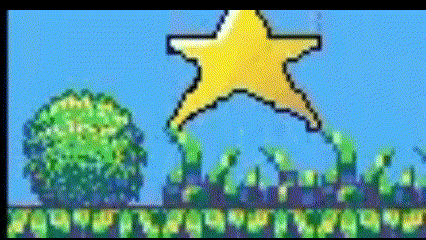

# construct 3 黑猫历险记
## 一、前言
本游戏是一款使用 construct 3 开发的2D平台跳跃冒险小游戏，游戏发布于[https://www.construct.net/en/free-online-games/cat-adventure-68994/play](https://www.construct.net/en/free-online-games/cat-adventure-68994/play)，可以在网页上直接点击游玩，且该网页附有本项目的源文件。

其玩法展示视频发布于[https://www.bilibili.com/video/BV1vEsZeVEB9/?vd_source=860e102eca6bfc0ff91656c2891e3f5d](https://www.bilibili.com/video/BV1vEsZeVEB9/?vd_source=860e102eca6bfc0ff91656c2891e3f5d)

本游戏的灵感来源是 construct 3 的入门小游戏，但是入门的平台跳跃小游戏未免过于简单（只有平台、玩家与奖励）。

所以我在阅读了游戏设计工坊（*Game Design Workshop*）后，对游戏进行大改。

在下文中，我将先在第二部分介绍我基于游戏设计工坊所衍生出的设计思路，之后会介绍我如何使用 construct 3 实现我的灵感。为了更简洁的介绍我的实现，也为了一些 construct 3 的新手，我将我总结的一些有用的入门知识单独放在了第三部分。在第四部分，我会具体讲解一些元素的设计。

## 二、游戏设计总体思路
游戏的设计灵感绝不是一拍脑门就能定下的。有时候可能会有突然的灵光一现，觉得某个元素格外有趣，可是将它编成游戏后，又会觉得只有这个元素未免过于枯燥，想要再添加一些要素又无从下手。

在本部分，我将结合游戏设计工坊的*设计戏剧化元素*、*趣味性和可接近性*与*游戏测试*三部分来讲解我的设计灵感与思路。

一个好的游戏，必须有两个或以上的玩家（这可以包括现在的玩家与过去的玩家），这意味着玩家需要竞争与比较，他需要操控这个游戏，并在每局游戏结束后，可以得到不同的结果。不完美的结局或者是未达成的全成就会促进玩家重复开始游戏，这会增长游戏的游玩周期。

所以，我们需要设计奖励与惩罚。奖励可以激励玩家，让玩家更有成就感，也可以让玩家在每局游戏结束后，根据不同的操作，获得不同的奖励，以此获得更多的控制感与成就感，并且可以与过去的自己竞争。惩罚则是引入了死亡，让玩家稍有不慎就可能结束游戏。

在引入死亡的过程中，还带来了一个很好的要素——陷阱与挑战。挑战是一个很好的吸引玩家的要素，挑战的难度需要设计的刚刚好，在玩家厌烦挑战之前让其通过，以获得成就感与愉悦感。为此，我们需要设计多种多样的陷阱，并让它卡的刚刚好。

此外，为了让玩家获得更好的游戏体验感，需要让游戏具有更好的易接近性：

1.我们需要设计新手引导。

2.为了降低游戏难度，防止玩家一直卡在重复的陷阱却需要反复通过前面的陷阱，我设计了存档。这可以防止玩家因为需要反复通过某关卡而产生厌烦感。

游戏的制作少不了游戏测试。测试不仅仅是为了发现bug，还为了调节游戏难度，增加趣味性等。

在测试时，应尽可能测试所有的事件，观察它是否达到了应有的效果，是否有产生什么奇怪的bug。此外，还应邀请其他人员测试，这是为了观察游戏是否能够达到想要的效果。开发者对游戏的步骤总是感觉理所当然的，但是对玩家来说却不是，正因如此，才需要邀请与开发无关的测试人员。

在我制作这个游戏时，我邀请了我的朋友试玩，发现新手指引做的还是不够清楚，且游戏难度还是做的太高了，于是我新增了提示，且增加了存档点，以便让大部分玩家获得更好的游戏体验。

## 三、construct 3 简易入门

<u>如果你已经熟悉construct 3了，可以跳过这一部分。</u>

为了方便接下来的讲解，我先介绍并总结一下我认为需要注意的对象、行为与事件设计。在此之前，推荐先完成 construct 3 的入门教程。

### 对象类型
#### 精灵
最常用的对象类型，如无例外，都设计为精灵类型即可。
#### 平铺图
平台这种需要大量创建，且需要在同一水平线或竖直线创建的对象，首推设计为平铺图。这可以让你创建出来的对象是平整的。
### 行为
#### 正弦运动
可以等效为为精灵添加动画效果，很好用且有多样性的行为。

例如，为对象添加正弦运动后，设置运动为上下运动，将振幅调小，即可让对象产生轻微的上下浮动，以此让画面动起来。也可以为陷阱添加这种行为，让陷阱动起来，以增加游戏难度

效果如下：

#### 补间动画
通过设置透明度，可以为对象增加一种淡入淡出的效果，适合用来做提示或结束的动画效果：

要达成这种设置，需要添加事件，让透明度逐渐减小：

#### 旋转与环绕
*旋转*使得对象连续旋转自身，*环绕*则是绕着某个中心点做椭圆运动，两者叠加可以设置新的陷阱，增加游戏的多样性

#### 平台与实体
*平台*允许玩家在*实体*上跳跃与奔跑。这两个是2D平台跳跃冒险游戏的重要组成部分。

## 四、具体设计
在本部分，我将分模块介绍各元素的对象类型设计、行为设计与事件表设计，其中，各元素如无例外都是设计为精灵类型。

### 玩家
玩家要在平台上跳跃，所以需要添加**平台**行为。此外，由于我为玩家添加了行走与静止的动画，所以需要在事件表中添加相应的逻辑，这需要使用到**键盘**对象。又由于我做了一个长地图，所以需要添加**镜头跟随**与**边界约束**行为。

### 键盘
玩家在添加了实体行为后即可通过键盘操控，但是简单的上下左右的移动并不能满足游戏要求，所以才需要添加键盘对象。玩家需要在往右走时播放往右走的动画，停下时播放朝右边静止的动画，反之同理。为此，<u>需要为按住与松开方向键时添加事件，播放相应的动画</u>。此外，游戏当然需要重启的方法，本游戏设计 R 键为重启键，添加重载场景的事件。

### 存档
在介绍陷阱之前，我想先介绍一下存档。由于引入了死亡机制，为了避免游戏难度太高，玩家一直卡在重复的陷阱却需要重复通过前面的陷阱，我设计了存档。存档主要是为了可以使得玩家死亡后在存档点复活，所以我设计了全局变量*存档点x*和*存档点y*，并为存档添加了事件：<u>当玩家与存档相碰时，设置存档点的坐标为此时猫的坐标。</u>

为了突出存档，使游戏更鲜活，我还使得存档可以上下浮动，为此，我添加了***正弦运动***行为(就如我之前所推荐的，正弦运动确实非常好用！)

### 陷阱
本游戏的设计为不能掉在平台之外，所以我在平台之外设计了海洋，玩家与海洋重叠时会死亡并重置游戏，为此需要添加*销毁对象*与在存档点*创建对象*的事件。此外，我还设计了尖刺这一陷阱，玩家不能与尖刺碰撞。为了节省事件数（免费版有事件限制），我将这两个事件的触发设计为了OR条件，合并成了一个事件。

为了给玩家正反馈，我还设计了敌人，击败敌人的方式为踩敌人。当击败敌人时，会出现星星奖励，玩家可以收集这个奖励。

为此，需要先设计事件表：当玩家在下落时碰撞到敌人（即为踩到了敌人），那么就要销毁敌人并创建星星对象。由于我需要播放动画，需要等待一段时间，为了防止重复触发敌人死亡事件，我又*添加了布尔变量*来判断是否已进入该事件。此外，为了让游戏更加丝滑与真实，我让玩家向上跳跃，以此创造一种踩完敌人后弹跳的感觉。

其效果如下：

为了保证陷阱的多样性，需要有静止的陷阱，也需要有运动的陷阱，且运动方式不能单一。这可以用到**正弦运动**，此外，同时运用**旋转**与**环绕**也可以做出新的效果：

### 奖励
奖励可以让玩家更加的积极，且为了让玩家对每局游戏有掌控感，需要在游戏结束时播报奖励的获得情况，为此，我们需要记录玩家的奖励获得数，为此我设计了全局变量--星星数。玩家每获得一颗星星，星星数会加一。而星星的获得则是玩家与星星的碰撞事件，与敌人销毁时一样，为了播放星星消失时的动画，我们需要添加销毁的判定。

为了减少工作量，星星动画其实可以不由我们自己设计，我们可以使用 construct 3 的滤镜。如上述事件表所示，我使用了水晶球与漩涡滤镜，以让其产生消失的效果：

### 平台与背景
**平台**为平台跳跃游戏的基石，是需要大量重复创造的元素，为了保证一个平台是平整的，可以把平台的对象类型设置成平铺图。此外为了保证玩家在其上跳跃，需要添加**实体**行为。

背景可以让一款游戏更加美观，在设计背景时，需要注意背景的*图层*，背景最好都放入底部图层中。另外，可以使用*子弹*与*边界窜梭*行为来让背景循环动起来。在游戏测试中，需要注意是否有重叠遮挡的现象，尤其需要注意玩家是否会被遮挡。

### 音频
背景音乐与音效可以为游戏增色，而这依赖于*音频*。音频对象可以播放bgm，在场景开始时，即可加载背景音乐并将它设为循环播放，之后，可以在获得奖励或死亡时插播各种音效，增强体验感。好的音效可以增强玩家与游戏的互动感，可以让玩家知道他们已经成功触发了某个事件。

## 五、一些碎碎念
这个游戏是我的3D游戏编程与设计的课程作业，一开始没想到会花这么多时间。

最初本来以为做个小游戏，手到擒来，结果直接败在了第一关——要做什么。无论是什么事，最难的都是从0到1。我一开始根本就不知道该做什么游戏好，瞪着电脑，无从下手。后来去玩了官网的游戏，才一点点的有了些许思路，之后便是边做边改，又结合了游戏设计工坊的理论，这才慢慢改成了目前的模样。

这是我做的第一款游戏，虽然游戏地图比较短，但是各项基本功能也都俱全了。结果上来讲，还是很满意并且符合我的预期的，就是过程实在是痛并快乐着。由于是第一款游戏，所以没有什么经验，开发前只是有了一个总体的思路，没有做过具体的策划，投入的时间总是超过我的预期。我忍不住去改进每一个不完美的小点与基本不会被发现的bug，美工与音乐也忍不住想找的更多，毕竟是第一款游戏，我总是想着要让它更完美一些。

在一次次的游戏测试中，我本来以为会枯燥而无味，但是我没有。每一次玩这个我亲手创作的游戏，我都感到由衷的开心。最后，也祝愿其他的游戏开发者能收获属于自己的快乐。